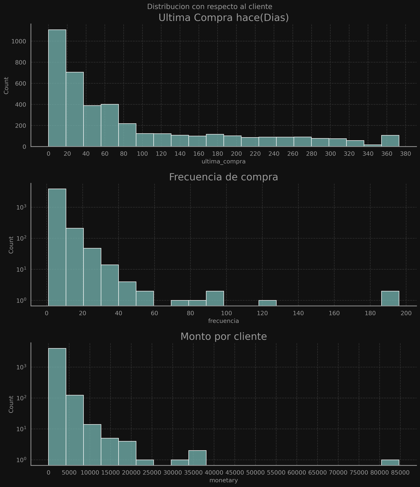
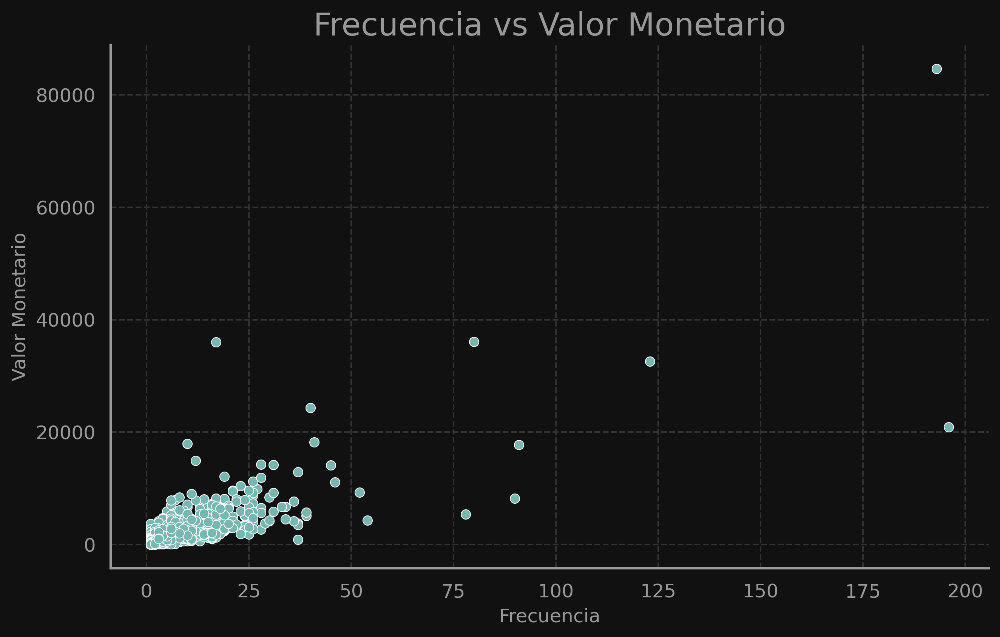
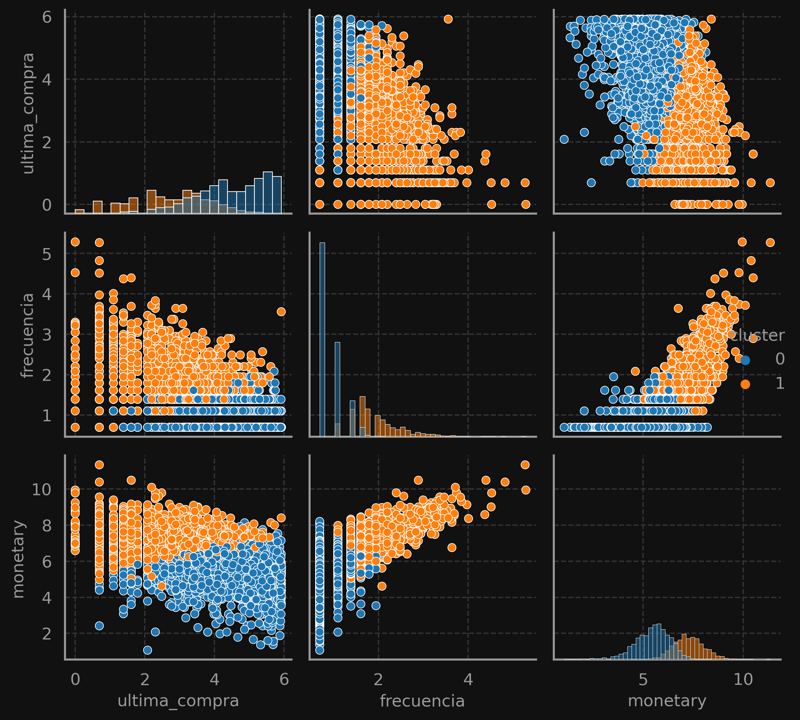

# 📊 Segmentación de Clientes E-Commerce con RFM y Clustering


## 📌 Descripción

Este proyecto analiza datos de ventas de un e-commerce y aplica técnicas de segmentación de clientes utilizando el modelo **RFM (Recency, Frequency, Monetary)** junto con **K-Means Clustering**.  
El objetivo es identificar grupos de clientes con comportamientos de compra similares para optimizar estrategias de marketing y aumentar las ventas.

---

## 📂 Tabla de Contenidos

1. [Acerca del Proyecto](#acerca-del-proyecto)
2. [DataSet](#dataSet)
3. [Metodología](#metodología)
4. [Resultados](#resultados)
5. [Visualizaciones](#visualizaciones)
6. [Tecnologías Usadas](#tecnologías-usadas)
7. [Resultados de análisis](#resultados-de-analisis)
8. [Ejemplo Visualizaciones](#ejemplo-visualizaciones)
9. [Cómo Ejecutar el Proyecto](#instalacion-y-Uso)
10. [Licencia](#licencia)
11. [Contacto](#contacto)

---

## 📖 Acerca del Proyecto

El análisis se basa en un dataset de transacciones históricas de clientes.  
Mediante **RFM Analysis** se calcula:

- **Recencia (última_compra)**: Días desde la última compra.
- **Frecuencia (frecuencia)**: Número de compras realizadas.
- **Valor Monetario (monetary)**: Total gastado por cliente.

Posteriormente, se aplica **K-Means Clustering** para segmentar a los clientes y extraer insights accionables.

Este análisis se enfoca únicamente en ventas (excluyendo devoluciones y cancelaciones) y tiene tres subenfoques:

1. Análisis centrado en el cliente.
2. Análisis centrado en el tiempo.(Sección en desarrollo, se implementara en la proxima version)
3. Análisis centrado en la geografía.(Sección en desarrollo, se implementara en la proxima version)

---

## 📁 DataSet

Contiene todas las transacciones realizadas entre el 01/12/2010 y el 09/12/2011 por un minorista en línea no comercial registrado, con sede en el Reino Unido.  
La empresa vende principalmente regalos únicos para diversas ocasiones y muchos de sus clientes son mayoristas.

**Fuente**: [Online Retail Dataset](https://www.kaggle.com/datasets/ulrikthygepedersen/online-retail-dataset) por Ulrik Thyge Pedersen, basado en datos de [UCI Machine Learning Repository](http://archive.ics.uci.edu/ml/datasets/Online+Retail).

**Licencia**: [Creative Commons Attribution 4.0 International (CC BY 4.0)](https://creativecommons.org/licenses/by/4.0/).  
Se permite el uso, distribución y modificación con atribución a los autores originales.

---

## 🛠️ Metodología

1. **Carga y Limpieza de Datos**
   - Eliminación de valores nulos y registros inconsistentes.
   - Conversión de fechas y cálculo de métricas RFM.
2. **Transformación**
   - Aplicación de `np.log1p()` para reducir la asimetría de los datos.
   - Estandarización de variables para clustering.
3. **Análisis Exploratorio**
   - Visualización de distribuciones.
   - Correlaciones entre métricas RFM.
4. **Modelado**

   - Pruebas con distintos valores de `k` para encontrar el número óptimo de clusters.
   - Evaluación con métricas: **SSE**, **Silhouette Score**, **Davies-Bouldin**, **Calinski-Harabasz**.
   - Selección de **k=2** para el enfoque principal.

5. **Interpretación y KPIs**
   - Comparación de tamaño, ventas y frecuencia por cluster.
   - Identificación de clientes VIP y clientes habituales.

---

## 📈 Resultados

**Conclusiones del Enfoque 1**:

- **Cluster 1 (Naranja)**: Clientes VIP (38.8% de clientes) generan el **80.4% de las ventas** y el **75% de las compras**.  
  → Recomendación: Enfocar estrategias y promociones premium hacia este grupo.
- **Cluster 0 (Azul)**: Clientes habituales o ex-clientes (61.2% de clientes) generan solo el **19.5% de las ventas**.  
  → Recomendación: No aumentar inversión, pero considerar planes de reactivación.

**KPIs:**
| Cluster | % Clientes | % Ventas | % Compras | Gasto Promedio |
|---------|------------|----------|-----------|----------------|
| 0 | 61.19% | 19.55% | 24.50% | 328.28 |
| 1 | 38.80% | 80.44% | 75.49% | 2129.98 |

---

## 📊 Visualizaciones

Algunas de las gráficas generadas:

- **Clusters en 3D (Recencia, Frecuencia, Monetario - Log)**
- **Pairplot de variables RFM por cluster**
- **Histplot de distribución de clientes**
- **Curvas SSE y Silhouette para selección de k**

---

## 💻 Tecnologías Usadas

- **Python 3.10+**
- **Pandas**
- **NumPy**
- **Matplotlib**
- **Seaborn**
- **Scikit-learn**
- **Jupyter Notebook / Kaggle Notebooks**

---

## 📊 Resultados del Análisis

### Segmentos Encontrados:

- **Cluster 1 (Naranja)** — Clientes VIP:

  - Representan el **38.5%** de los clientes.
  - Generan el **80%** de las ventas.
  - Realizan el **75%** de las compras.
  - **Recomendación:** Estrategias de retención, descuentos exclusivos, programas de fidelización.

- **Cluster 0 (Azul)** — Clientes Habituales / Exclientes:
  - Representan el **61.19%** de los clientes.
  - Aportan el **19.5%** de las ventas.
  - **Recomendación:** No aumentar inversión, pero considerar campañas de reactivación.

---

## 📷 Ejemplo Visualizaciones

| Distribución RFM                               | Frecuencia vs monetary                      | Clusters K-Means                   |
| ---------------------------------------------- | ------------------------------------------- | ---------------------------------- |
|  |  |  |

---

## ⚙️ Instalación y Uso

```bash

# 0. Prerrequisitos
# python 3.9+
pip install pandas numpy matplotlib seaborn scikit-learn

# 1. Clonar repositorio
git clone https://github.com/TU_USUARIO/ecommerce-rfm-segmentation.git
cd ecommerce-rfm-segmentation

# 2. Crear entorno virtual (opcional pero recomendado)
python -m venv venv
source venv/bin/activate  # En Windows usar venv\Scripts\activate

# 3. Instalar dependencias
pip install -r requirements.txt

# 4. Ejecutar Jupyter Notebook
jupyter notebook notebooks/analisis-de-ventas-ecommerce-segmentacion.ipynb
```

---

## 📄 Licencia

Distributed under the MIT License. See `LICENSE` for more information.

Copyright (c) 2025 Dylan Saavedra

## Contacto

Dylan Saavedra
Ingeniero Electrónico
dylan.saavedrago@gmail.com
